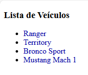

# Desafio_da_Sprint2

Claro! Vou criar um exemplo de **README** para o seu repositório no GitHub, considerando as etapas e tarefas do seu desafio.

---

# **Desafio de Versionamento e Metodologias Ágeis**

Este repositório foi criado para o desafio de versionamento de arquivos e aplicação da metodologia ágil **SCRUM**. O desafio consiste em controlar o versionamento das alterações feitas em arquivos de um projeto, utilizando o **Git** e o **GitHub**.

## **Objetivo do Desafio**

O objetivo deste projeto é implementar as histórias de usuário que foram priorizadas no **Sprint** atual e utilizar o controle de versões do **Git/GitHub** para gerenciar e documentar as alterações feitas nos arquivos do projeto.

### **Histórias de Usuário Implementadas:**
- **História 1 (ID 1)**: Alteração da cor do texto dos nomes dos veículos na página **index.html**.
- **História 3 (ID 3)**: Alteração dos links e descrições na página **contato.html**.

## **Estrutura do Repositório**

Este repositório contém os seguintes arquivos e documentos:

- **index.html**: Arquivo da página principal com as alterações no nome dos veículos (História de Usuário ID 1).
- **contato.html**: Arquivo da página de contato com as alterações nos links (História de Usuário ID 3).
- **Sprint_Backlog.txt**: Documento contendo as histórias de usuário que foram implementadas neste Sprint, com a estimativa de esforço.
- **Sprint_Retrospective.txt**: Documento de reflexão sobre o Sprint, abordando o que funcionou bem, o que não funcionou e sugestões de melhorias.

## **Sobre o Sprint Retrospective**

Ao final do Sprint, a equipe deve refletir sobre o que funcionou bem, o que não funcionou e como as ferramentas e os processos podem ser melhorados no próximo ciclo. As sugestões de melhorias são essenciais para otimizar o trabalho nas próximas iterações.
